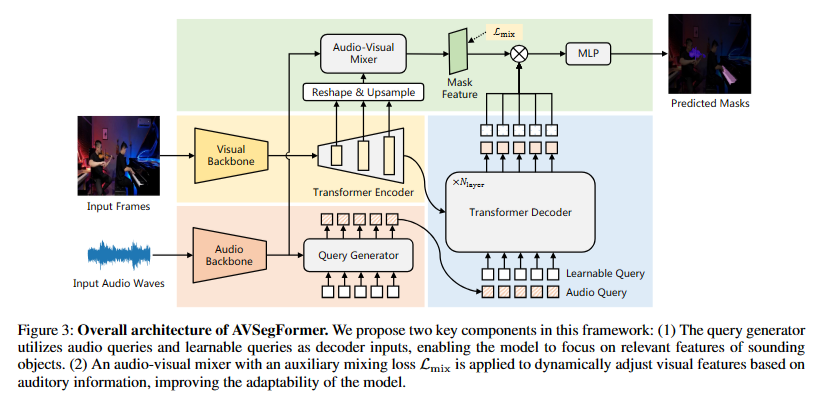

# AVSegFormer: Audio-Visual Segmentation with Transformer


## News
- (2023.04.28) Upload pre-trained checkpoints and update README.
- (2023.04.25) We completed the implemention of AVSegFormer and push the code.

---

This repository provides pytorch implementation for the paper ["Audio-Visual Segmentation with Transformer"](). 

## Abstract
The combination of vision and audio has long been a topic of interest among researchers in the multi-modal field. Recently, a new audio-visual segmentation task has been introduced, aiming to locate and segment the corresponding sound source objects in a given video. This task demands pixel-level fine-grained features for the first time, posing significant challenges. In this paper, we propose AVSegFormer, a new method for audio-visual segmentation tasks that leverages the Transformer architecture for its outstanding performance in multi-modal tasks. We combine audio features and learnable queries as decoder inputs to facilitate multi-modal information exchange. Furthermore, we design an audio-visual mixer to amplify the features of target objects. Additionally, we devise an intermediate mask loss to enhance training efficacy. Our method demonstrates robust performance and achieves state-of-the-art results in audio-visual segmentation tasks.

## Method


---

## Environments
```shell
# recommended
pip install torch==1.10.0+cu111 torchvision==0.11.0+cu111 torchaudio==0.10.0 -f https://download.pytorch.org/whl/torch_stable.html
pip install mmcv-full -f https://download.openmmlab.com/mmcv/dist/cu111/torch1.10.0/index.html
pip install pandas
pip install timm
pip install resampy
pip install soundfile
# build MSDeformAttention
cd ops
sh make.sh
```


## Data

Please refer to the link [AVSBenchmark](https://github.com/OpenNLPLab/AVSBench) to download the datasets. You can put the data under `data` folder or rename your own folder. Remember to modify the path in config files. The `data` directory is as bellow:
```
|--data
   |--AVSS
   |--Multi-sources
   |--Single-source
```


## Download Pre-Trained Models

- The pretrained backbone is available from benchmark [AVSBench pretrained backbones](https://drive.google.com/drive/folders/1386rcFHJ1QEQQMF6bV1rXJTzy8v26RTV).
- We provides pre-trained models for all three subtasks. You can download them from [AVSegFormer pretrained models](https://drive.google.com/drive/folders/1ZYZOWAfoXcGPDsocswEN7ZYvcAn4H8kY).

|Backbone|Subset|Lr schd|Config|mIoU|F-score|Download|
|:---:|:---:|:---:|:---:|:---:|:---:|:---:|
|Res50|S4|30ep|[config](config/s4/AVSegFormer_res50_s4.py)|76.45|85.9|[ckpt](https://drive.google.com/file/d/11CvMJyMcLeNogrGiBRsC6MBAubfRf9Es/view?usp=share_link)|
|PvtV2|S4|30ep|[config](config/s4/AVSegFormer_pvt2_s4.py)|82.06|89.9|[ckpt](https://drive.google.com/file/d/1Gf61ZKmhoUMnc4QSmD9fpK4BFAh9Xbqq/view?usp=share_link)|
|Res50|MS3|60ep|[config](config/ms3/AVSegFormer_res50_ms3.py)|49.53|62.8|[ckpt](https://drive.google.com/file/d/1t8PAQkjCHgVKWkl9fstc7hAbZi7zGzqD/view?usp=share_link)|
|PvtV2|MS3|60ep|[config](config/ms3/AVSegFormer_pvt2_ms3.py)|58.36|69.3|[ckpt](https://drive.google.com/file/d/1Zp3USytNFdrBgeKJitq1_8qcGzhRx7NG/view?usp=share_link)|
|Res50|AVSS|30ep|[config](config/avss/AVSegFormer_res50_avss.py)|29.77|35.2|[ckpt](https://drive.google.com/file/d/1GNWoKsNqLFWlTMDwqkWc7xO6YCTwWR7U/view?usp=share_link)|
|PvtV2|AVSS|30ep|[config](config/avss/AVSegFormer_pvt2_avss.py)|36.66|42.0|[ckpt](https://drive.google.com/file/d/1M31vgu6rM7gGecRngvF2tAiZ6HwHM5_p/view?usp=share_link)|


## Train
```shell
TASK = "s4"  # or ms3, avss
CONFIG = "config/s4/AVSegFormer_pvt2_s4.py"

bash train.sh ${TASK} ${CONFIG}
```


## Test
```shell
TASK = "s4"  # or ms3, avss
CONFIG = "config/s4/AVSegFormer_pvt2_s4.py"
CHECKPOINT = "work_dir/AVSegFormer_pvt2_s4/S4_best.pth"

bash test.sh ${TASK} ${CONFIG} ${CHECKPOINT}
```


## Citation

If you use our model, please consider cite following papers:
```
@article{zhou2023avss,
      title={Audio-Visual Segmentation with Semantics}, 
      author={Zhou, Jinxing and Shen, Xuyang and Wang, Jianyuan and Zhang, Jiayi and Sun, Weixuan and Zhang, Jing and Birchfield, Stan and Guo, Dan and Kong, Lingpeng and Wang, Meng and Zhong, Yiran},
      journal={arXiv preprint arXiv:2301.13190},
      year={2023},
}

# Waiting...
```